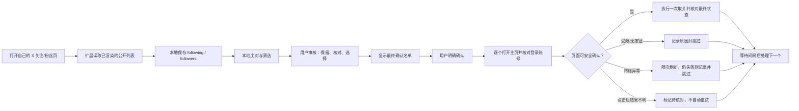
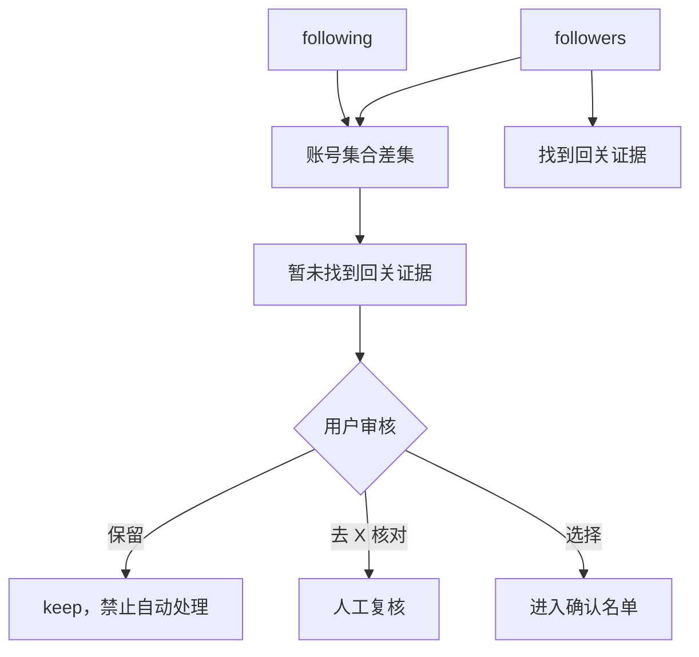
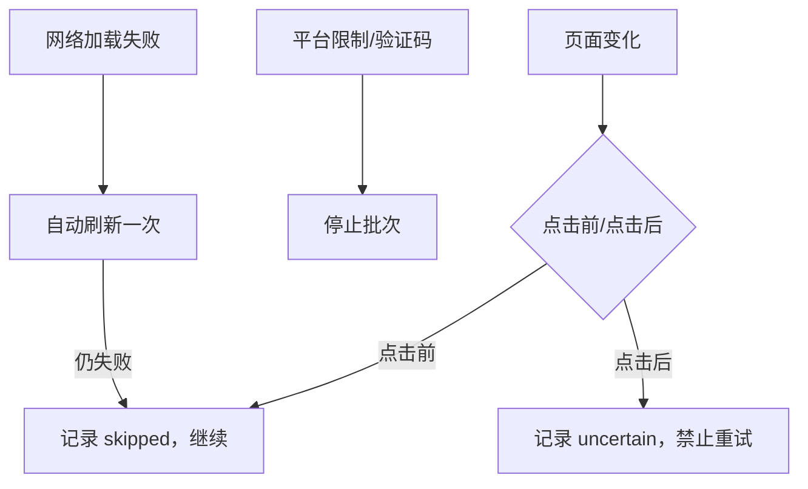
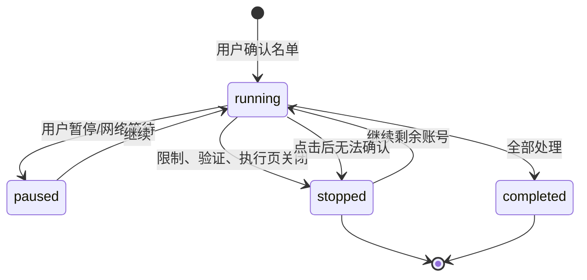
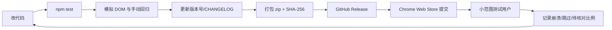

# 留关（Follow Review）开源项目指南

> 一个本地优先的浏览器扩展：在用户打开自己的 X 关注/粉丝列表后，收集页面中已经显示的账号，进行本地比对，并在用户明确确认后逐个处理取关。

本文同时是项目 README 的扩展版、贡献者指南和发布手册。项目面向希望整理 X 关注列表的个人用户；它不代表 X 官方，也不保证名单完整、账号安全或不会受到平台限制。

## 1. 项目定位

### 要解决的问题

用户可能关注了数千个账号，想找出“自己关注、但当前收集结果中没有回关证据”的账号，并分批人工确认后整理关注列表。

### 产品原则

1. **本地优先**：名单、审核标记和执行记录保存在当前浏览器的 `chrome.storage.local`，默认不上传服务器。
2. **证据优先**：没有在页面看到“关注了你”只代表“暂未找到证据”，不能直接断言对方没有回关。
3. **用户确认**：自动化动作只能来自用户选择和确认的名单。
4. **失败可见**：网络失败、受限页面、没有按钮、结果待核对都写入记录，不静默吞掉。
5. **保守停止**：登录账号变化、验证码、平台限制、点击后无法确认最终状态时，宁可停止或标记待核对，也不重复点击。

## 2. 合规与发布边界

这是项目能否长期发布的关键部分。

- 只处理用户自己已经登录、自己有权访问的 X 页面。
- 不读取密码、Cookie、私信、令牌或 Client Secret。
- 不调用 X 的非公开接口，不绕过验证码、登录保护或访问限制。
- 不伪造人工行为，不承诺“5 秒一次就不会被封”。速度设置不能改变平台规则。
- 不把“未找到回关证据”宣传成“确定没有回关”。
- 商店描述必须明确这是第三方工具，与 X 没有官方关联。
- 用户应先阅读 X 的自动化规则和 Chrome Web Store Developer Program Policies。规则变化时，项目维护者需要重新评估发布资格。

建议在商店和项目首页固定显示：

> Unaffiliated third-party extension. Use only with accounts and pages you are authorized to access. The extension does not guarantee complete data, uninterrupted execution, or protection from platform limits.

## 3. 工作流程



## 4. 当前功能

### 收集

- 从当前 X 的 Following 或 Followers 页面读取已渲染的账号卡片。
- 支持自动滚动到底部；页面隐藏、按下 Esc 或长时间没有新增内容时停止/暂停。
- 去重并保留积极证据，例如页面后来再次显示“关注了你”。
- 对关注数和粉丝数提供覆盖情况记录，但不声称一定收集完整。

### 本地比对



### 分批处理

- 每批最多 100 个账号。
- 默认账号之间等待 5 秒，可在 5–120 秒内调整。
- 等待时间不是 X 的安全阈值，也不是规避限制的承诺。
- 每个账号先检查：执行页 URL、登录账号、目标用户名、页面限制提示、唯一可用按钮和回关标记。
- 只有确认页面状态后才点击；点击后如果不能确认最终状态，标记“结果待核对”，不自动重试。
- X 的“暂时受限”警告页、没有取关按钮、主页多次加载失败会被记录并跳过。

## 5. 异常状态定义

| 状态 | 含义 | 是否继续批次 | 是否允许自动重试 |
|---|---|---:|---:|
| `success` | 观察到“正在关注”变为“关注” | 是 | 否 |
| `already` | 页面已经显示“关注” | 是 | 否 |
| `skipped` | 受限、无按钮、加载失败或已有保护证据 | 是 | 否 |
| `uncertain` | 已经点击过，但最终状态无法确认 | 是 | 否 |
| `cancelled` | 用户停止、页面变化或任务失效 | 否/按控制页状态 | 否 |
| `network_pause` | 旧版本的网络暂停状态；新版本会转换为记录并跳过 | 是 | 否 |

“结果待核对”账号会被 `Unfollow.eligible()` 排除，避免下一轮重复操作。用户可以通过 X 主页人工查看并在本地清单中重置/保留。

## 6. 安全边界

### 绝不自动做的事情

- 不点击“查看受限账号”按钮。
- 不点击订阅、购买、付费升级或支付按钮。
- 不处理未知弹窗。
- 不在登录账号不一致时继续。
- 不在点击后不确定时再次点击。
- 不通过服务器转发页面内容。

### 风险模型



## 7. 代码结构

```text
x-follow-review-extension/
├── manifest.json             # Manifest V3、权限和入口
├── background.js              # Service Worker 消息路由
├── core.js                    # 账号规范化、路由、CSV 等通用逻辑
├── collector.js               # 列表读取、自动滚动、收集进度
├── unfollow-core.js           # 可选条件与执行结果定义
├── unfollow-background.js     # 批次、租约、日志和状态机
├── unfollow-actions.js        # 在 X 页面执行只读检查与取关动作
├── unfollow-ui.js             # 清单页控制器、刷新、重试和进度 UI
├── dashboard.html/js          # 本地清单和审核界面
├── popup.html/js              # 工具栏弹窗
├── styles.css                 # 样式
├── tests/                     # Node test + linkedom 测试
└── 使用说明.md                # 面向普通用户的中文说明
```

任务状态机：



## 8. 本地开发

要求：Node.js 18+、Google Chrome 或 Chromium。

```bash
cd x-follow-review-extension
npm install
npm test
```

加载未打包扩展：

1. 打开 `chrome://extensions`。
2. 开启“开发者模式”。
3. 点击“加载未打包的扩展程序”。
4. 选择 `x-follow-review-extension` 目录。
5. 修改代码后点击扩展卡片的“重新加载”。
6. 刷新 `dashboard.html`，再用一个明确可测试的账号验证。

不要在真实大批次运行中直接重新加载扩展。更新前应先停止或完成当前批次，并导出 JSON/CSV 备份。

## 9. 测试清单

提交 Pull Request 前至少执行：

- `npm test` 全部通过。
- 收集页面错误站点、错误账号、重复账号和隐藏列表项。
- 自动滚动在页面隐藏、Esc、无新增内容时正确停止。
- 本地差集不会把“暂未找到”标成确定负面。
- 受限页不会点击“查看主页”。
- 没有按钮的主页不会点击侧栏或订阅按钮。
- 点击后结果不明不会自动重试。
- 断网/黑屏能自动刷新并在失败后跳过。
- 任务恢复不会重复已完成账号。
- 刷新扩展不会清空 `chrome.storage.local`。

测试账号应使用你有权访问的账号和模拟 DOM；不要为了测试提交真实取关。

## 10. GitHub 开源发布

### 推荐仓库结构

```text
README.md
GUIDELINE.md
LICENSE
PRIVACY.md
SECURITY.md
CHANGELOG.md
CODE_OF_CONDUCT.md
CONTRIBUTING.md
x-follow-review-extension/
└── ...
```

建议：

- 使用 MIT 或 Apache-2.0，并在代码中保留版权声明。
- `README.md` 放一句话定位、截图/流程图、安装、限制、测试和下载链接。
- `PRIVACY.md` 说明本地存储、无分析 SDK、无上传、权限用途、卸载后的数据行为。
- `SECURITY.md` 说明不要提交 Client Secret、Cookie、导出名单或截图中的个人数据，并提供漏洞报告邮箱/Issue 模板。
- 每次发布写 `CHANGELOG.md`，说明是否涉及权限、数据格式或执行行为。
- GitHub Release 附上版本号、zip 包、SHA-256 校验值和已知限制。

生成校验值：

```bash
shasum -a 256 output/x-follow-review-extension-v0.3.9.zip
```

## 11. Chrome Web Store 发布

发布前应在 Chrome Web Store Developer Dashboard 完成开发者注册、身份/支付信息（如平台要求）和商店资料。商店审核规则可能变化，提交前以官方页面为准。

### 商店素材

- 名称：避免使用 X/Twitter 官方品牌造成误导，例如 `Follow Review – Local X List Organizer`。
- 简短描述：说明“本地收集、人工确认、分批整理”，不要写“保证安全”“绕过限制”“自动清粉”。
- 详细描述：说明第三方关系、权限、数据流、限制和支持渠道。
- 图标：128×128 PNG，避免直接复制 X 官方标识。
- 截图：展示本地清单、审核、日志和暂停/继续，不展示真实用户的私密数据。
- 预览图：使用演示账号或脱敏数据。
- 隐私政策 URL：必须与扩展真实行为一致，并能公开访问。

### 权限说明模板

| 权限 | 用途 | 对用户的说明 |
|---|---|---|
| `activeTab` | 用户点击扩展时读取当前列表 | 只处理当前打开并授权的页面 |
| `scripting` | 在 X 页面读取已渲染账号和执行确认后的动作 | 不读取密码、Cookie 或私信 |
| `storage` | 保存本地名单、审核标记和执行日志 | 数据保存在当前浏览器 |
| `https://x.com/*` 可选权限 | 用户确认取关后访问执行页 | 只在用户开始执行时申请 |

### 可能导致审核拒绝的表述

避免：

- “模拟真人，绝不会封号”；
- “绕过 X 限制”；
- “无限批量取关”；
- “自动清理所有不回关”；
- “官方 X 工具”。

改为：

- “第三方、本地优先的列表整理工具”；
- “每批最多 100 个，用户确认后逐个处理”；
- “遇到限制、验证码或不确定结果会停止/跳过”；
- “请遵守 X 规则并自行承担使用责任”。

## 12. Firefox、Edge 和其他渠道

### Microsoft Edge Add-ons

通常可从 Chrome 扩展迁移，但要分别检查商店名称、隐私政策、截图和权限说明。使用 Edge 的开发者后台重新提交，不要假设 Chrome 审核结果自动适用。

### Firefox Add-ons

使用 Firefox 的 Manifest V3 兼容性检查，确认 `chrome.scripting`、Service Worker 和可选 host permissions 行为。发布前在 Firefox Developer Edition 进行完整回归测试。

### GitHub Release / 自托管

适合开发者和测试用户。发布 zip 时附安装说明、版本号、SHA-256 和风险说明。不要把 GitHub zip 的安装体验描述成“已经通过 Chrome 商店审核”。

### 其他目录

可以提交到 Product Hunt、AlternativeTo、Reddit 相关社区或个人网站，但发布内容必须遵守各社区规则；不要刷评论、伪造用户、购买虚假评价或在未经允许的社区批量推广。

## 13. 隐私政策最小模板

项目应单独维护一份 `PRIVACY.md`，至少回答：

1. 收集什么：用户当前列表中公开显示的用户名、昵称和关系证据。
2. 收集到哪里：默认只存储在当前浏览器的 `chrome.storage.local`。
3. 是否上传：默认不上传到项目维护者或第三方服务器。
4. 权限为何存在：逐项解释 `activeTab`、`scripting`、`storage` 和 X host permission。
5. 用户如何删除：在清单中开启新一轮、清除扩展数据或卸载扩展前先导出备份。
6. 联系方式：隐私问题和安全问题的公开联系渠道。
7. 变化通知：隐私政策修改时更新版本记录。

## 14. 版本发布流程



发布前检查：

- [ ] 版本号在 `manifest.json`、`package.json`、弹窗和清单页一致。
- [ ] `npm test` 通过。
- [ ] 没有密钥、Cookie、导出名单或真实截图进入 Git。
- [ ] `manifest.json` 的权限是最小集合。
- [ ] 隐私政策与实际数据流一致。
- [ ] 商店描述没有官方背书或规避限制承诺。
- [ ] zip 可被重新安装，SHA-256 已记录。
- [ ] 用脱敏账号完成一次收集、审核、跳过、待核对和恢复测试。

## 15. 运营与迭代指标

开源项目早期不要只看安装量，建议记录匿名、聚合后的产品指标（如果未来加入统计，必须先更新隐私政策并征得适当同意）：

- 安装到首次收集的转化率；
- 收集完成率；
- 每批成功、跳过、受限、待核对和网络失败的比例；
- 用户点击“继续剩余账号”的比例；
- 卸载/反馈中的主要原因；
- GitHub Issue 首次响应时间和修复版本。

默认不接入远程分析。可以先通过 GitHub Discussions、Issue 模板和可选的用户主动反馈来收集需求。

## 16. 维护者决策规则

当 X 页面结构改变时，先修复“只读识别”和“失败安全”，再考虑新的自动化动作。任何无法证明不会重复点击、误点订阅/购买按钮或跨账号操作的改动，都不应合并。

当商店政策、X 规则或浏览器权限模型发生变化时，优先暂停受影响功能并更新说明，再发布兼容版本。项目的长期可信度比一次批次完成率更重要。
