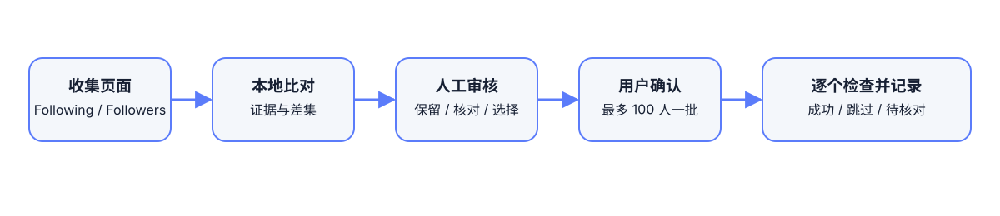

# Follow Review · 留关

本地优先的 X 关注列表整理扩展。它读取用户当前打开的关注/粉丝页面，进行本地比对，并在用户确认后分批处理名单。



> Third-party project. Not affiliated with X. Use only with pages and accounts you are authorized to access. The extension does not guarantee complete data or protection from platform limits.

## 快速开始

1. 下载 GitHub Release 中的 zip，或克隆本仓库。
2. 在 `chrome://extensions` 开启开发者模式，选择“加载未打包的扩展程序”。
3. 打开自己的 X Following/Followers 页面，点击扩展图标开始收集。
4. 在本地清单审核账号。没有回关证据不等于确定没有回关。
5. 仅选择你已核对的名单，确认后再执行分批整理。

完整的开发、测试、Chrome Web Store、Edge、Firefox、隐私和运营指南见 [GUIDELINE.md](GUIDELINE.md)。

## 数据与权限

名单和日志默认保存在当前浏览器的 `chrome.storage.local`。项目不读取密码、Cookie、私信或 Client Secret，也没有默认分析 SDK 或远程服务器。

## 开发

```bash
npm install
npm test
```

## 许可证

发布前请在仓库根目录补充许可证文件，并在商店资料中保持名称、权限和隐私政策一致。
